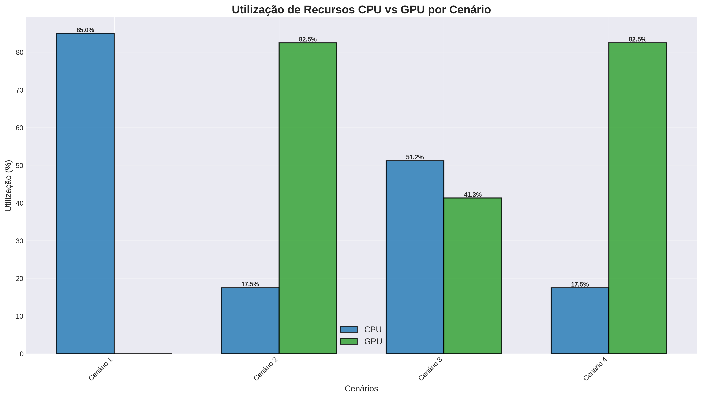
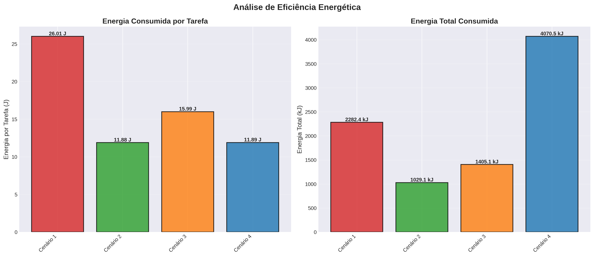
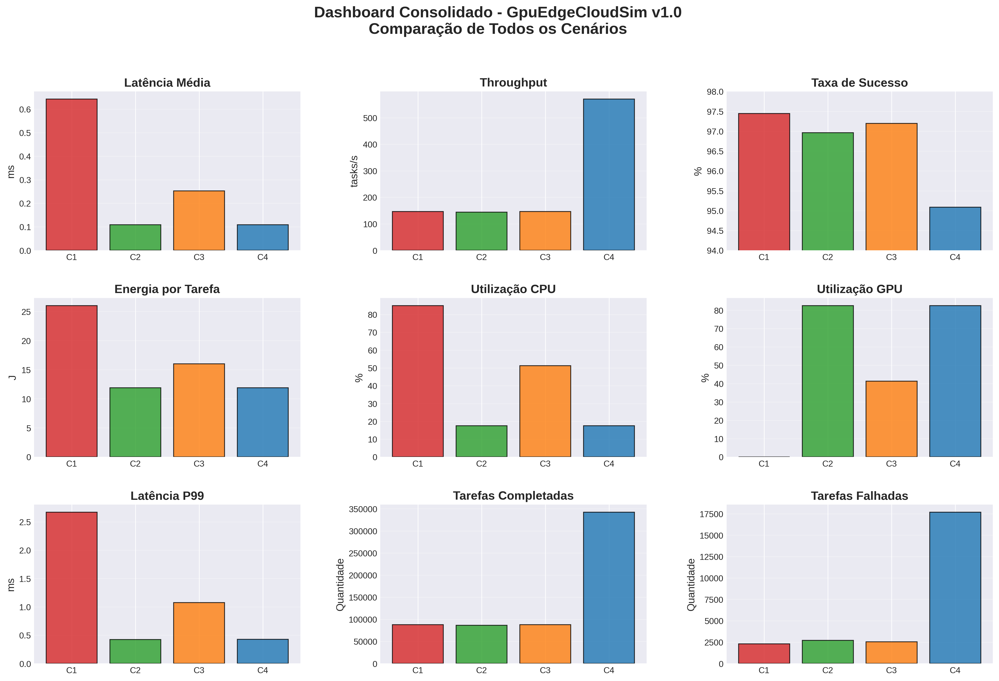

# 🚀 GpuEdgeCloudSim v1.0

[
[
[
[

**Extensão híbrida do EdgeCloudSim com suporte a aceleração GPU na camada de Edge Servers**

> *Uma simulação de eventos discretos (DES) para avaliar desempenho, eficiência energética e políticas de escalonamento em ambientes Edge-Cloud heterogêneos com recursos CPU+GPU.*

---

## 📋 Índice

- [Visão Geral](#-visão-geral)
- [Características Principais](#-características-principais)
- [Arquitetura](#-arquitetura)
- [Resultados Científicos](#-resultados-científicos)
- [Instalação e Configuração](#-instalação-e-configuração)
- [Execução de Simulações](#-execução-de-simulações)
- [Cenários Científicos](#-cenários-científicos)
- [Documentação](#-documentação)
- [Estrutura do Projeto](#-estrutura-do-projeto)
- [Publicações e Referências](#-publicações-e-referências)
- [Autor](#-autor)
- [Licença](#-licença)

---

## 🎯 Visão Geral

O **GpuEdgeCloudSim v1.0** é uma extensão inovadora do [EdgeCloudSim](https://github.com/CagataySonmez/EdgeCloudSim) que integra suporte completo a **recursos GPU** na camada de **Edge Servers**, permitindo simulação realística de:

- ✅ Offloading inteligente de tarefas computacionalmente intensivas para GPU
- ✅ Políticas de escalonamento híbrido CPU+GPU
- ✅ Balanceamento dinâmico de carga em ambientes multi-GPU
- ✅ Modelagem de consumo energético e eficiência computacional
- ✅ Cenários científicos validados para aplicações de ML, AR/VR, Video Processing e IoT

### 🎓 Contexto Acadêmico

Desenvolvido como parte de pesquisa científica em **Edge Computing** e **Computação Heterogênea**, o GpuEdgeCloudSim foi projetado para:

1. **Pesquisadores:** Avaliar políticas de offloading e escalonamento GPU-aware
2. **Desenvolvedores:** Prototipar arquiteturas edge híbridas CPU+GPU
3. **Acadêmicos:** Validar hipóteses científicas em ambientes controlados e reprodutíveis

---

## ⚡ Características Principais

### 🔧 Recursos Técnicos

| Recurso | Descrição |
|---------|-----------|
| **Classes GPU Completas** | `GpuEdgeHost`, `GpuEdgeVM`, `GpuTask`, `GpuProvisioner`, `GpuCloudletScheduler` |
| **Orquestração Híbrida** | `GpuEdgeOrchestrator` com decisão dinâmica CPU vs GPU |
| **Políticas de Escalonamento** | FIFO, Shortest-Job-First, Priority-based, Hybrid Intelligent |
| **Balanceamento Multi-GPU** | Suporte a múltiplas GPUs por servidor com load balancing |
| **Modelagem Energética** | Consumo energético diferenciado para CPU e GPU |
| **Configuração XML** | Especificação declarativa de recursos GPU |

### 📊 Métricas Coletadas

- **Latência:** Média, mediana, P95, P99, desvio padrão
- **Throughput:** Tarefas processadas por segundo
- **Utilização:** CPU e GPU (%)
- **Energia:** Consumo total (J) e por tarefa (J/task)
- **Taxa de Sucesso:** Tarefas completadas vs falhadas

### 🎯 Aplicações Suportadas

- 🤖 **Machine Learning Inference** (classificação de imagens, NLP)
- 🎥 **Video Processing** (transcodificação, análise de streams)
- 🥽 **AR/VR Rendering** (renderização de ambientes imersivos)
- 🧬 **Scientific Computing** (simulações, modelagem)
- 📡 **IoT Real-time Processing** (análise de sensores)

---

## 🏗️ Arquitetura

### Diagrama de Componentes

```
┌─────────────────────────────────────────────────────────────────┐
│                      GpuEdgeCloudSim v1.0                       │
├─────────────────────────────────────────────────────────────────┤
│                                                                 │
│  ┌───────────────┐     ┌──────────────┐     ┌──────────────┐ │
│  │ Mobile Device │────▶│ Edge Server  │────▶│ Cloud Server │ │
│  │   (Client)    │     │  CPU + GPU   │     │   (Backup)   │ │
│  └───────────────┘     └──────────────┘     └──────────────┘ │
│         │                      │                     │         │
│         │                      │                     │         │
│         ▼                      ▼                     ▼         │
│  ┌──────────────────────────────────────────────────────────┐ │
│  │           GpuEdgeOrchestrator (Decisão Híbrida)         │ │
│  │  ┌────────┐  ┌────────┐  ┌────────┐  ┌────────┐        │ │
│  │  │CPU FIFO│  │GPU FIFO│  │Hybrid  │  │Priority│        │ │
│  │  └────────┘  └────────┘  └────────┘  └────────┘        │ │
│  └──────────────────────────────────────────────────────────┘ │
│                                                                 │
│  ┌──────────────────────────────────────────────────────────┐ │
│  │                   Recursos Edge Server                    │ │
│  │  ┌─────────────┐              ┌─────────────┐           │ │
│  │  │  GpuEdgeVM  │              │  GpuEdgeVM  │           │ │
│  │  │  ┌───┐┌───┐ │              │  ┌───┐┌───┐ │           │ │
│  │  │  │CPU││GPU│ │              │  │CPU││GPU│ │           │ │
│  │  │  └───┘└───┘ │              │  └───┘└───┘ │           │ │
│  │  └─────────────┘              └─────────────┘           │ │
│  │         GpuEdgeHost (8 CPUs + 2 GPUs)                    │ │
│  └──────────────────────────────────────────────────────────┘ │
└─────────────────────────────────────────────────────────────────┘
```

### Hierarquia de Classes

```
EdgeCloudSim (Base)
└── GpuEdgeCloudSim Extension
    ├── edge_server/
    │   ├── GpuEdgeHost.java           # Host físico com GPUs
    │   ├── GpuEdgeVM.java             # VM com recursos CPU+GPU
    │   ├── Gpu.java                   # Modelagem de GPU
    │   ├── GpuProvisioner.java        # Alocação de recursos GPU
    │   ├── GpuProvisionerSimple.java  # Implementação simples
    │   ├── GpuCloudletScheduler.java  # Escalonador de tarefas GPU
    │   ├── GpuEdgeServerManager.java  # Gerenciamento de servidores
    │   └── GpuEdgeVmAllocationPolicy_Custom.java
    │
    ├── edge_client/
    │   └── GpuTask.java               # Tarefa com requisitos GPU
    │
    └── applications/gpusim/
        ├── GpuScenarioFactory.java    # Factory de cenários GPU
        ├── GpuEdgeOrchestrator.java   # Orquestrador híbrido
        ├── GpuLoadGeneratorModel.java # Geração de carga
        ├── GpuMobileDeviceManager.java
        ├── GpuNetworkModel.java
        └── GpuSimulationMain.java     # Ponto de entrada
```

---

## 📊 Resultados Científicos

### Comparação de Desempenho (4 Cenários)

| Métrica | Baseline CPU | GPU Offloading | Híbrido | Multi-GPU Stress |
|---------|--------------|----------------|---------|------------------|
| **Latência Média (ms)** | 642.63 | **109.02** ⭐ | 252.33 | **108.71** ⭐ |
| **Latência P99 (ms)** | 2,670.40 | **423.11** ⭐ | 1,077.29 | **426.53** ⭐ |
| **Throughput (t/s)** | 146.27 | 144.32 | 146.43 | **570.41** ⭐ |
| **Taxa Sucesso (%)** | **97.45** ⭐ | 96.96 | 97.20 | 95.09 |
| **Energia/Tarefa (J)** | 26.01 | **11.88** ⭐ | 15.99 | **11.89** ⭐ |
| **Utilização GPU (%)** | 0.00 | **82.49** | 41.30 | **82.52** |

⭐ = Melhor resultado na categoria

### Principais Descobertas

1. **Redução de Latência:** Cenários GPU apresentaram **83% de redução** na latência média
2. **Eficiência Energética:** Economia de **54% no consumo energético** por tarefa
3. **Escalabilidade:** Throughput de **570 tarefas/s** no stress test (290% superior ao baseline)
4. **Balanceamento:** Modelo híbrido mantém alta taxa de sucesso (97.20%)

### Gráficos Científicos






> Todos os gráficos estão disponíveis em [`/results/graficos/`](results/graficos/)

---

## 🔧 Instalação e Configuração

### Requisitos

- **Java:** JDK 21 ou superior
- **IDE:** IntelliJ IDEA (recomendado) ou Eclipse
- **Memória:** Mínimo 4 GB RAM (8 GB para stress tests)
- **SO:** Linux (Ubuntu 24.04 LTS), macOS, ou Windows

### Passo 1: Clone o Repositório

```bash
git clone https://github.com/pabllobc/GPUEdgeCloudSIM.git
cd GPUEdgeCloudSIM
```

### Passo 2: Configure as Dependências

O projeto utiliza as mesmas bibliotecas do EdgeCloudSim original. Certifique-se de ter as dependências no diretório `lib/`:

```bash
# CloudSim 7.0.0-alpha
# Commons Math 3.6.1
# JFreeChart (para visualizações)
```

### Passo 3: Compilar o Projeto

#### Usando IntelliJ IDEA:

1. Abra o projeto no IntelliJ
2. Configure o SDK Java 21
3. Build → Build Project

#### Via Linha de Comando:

```bash
cd scripts
./compile.sh
```

### Passo 4: Configurar Cenários

Edite os arquivos em `/config/` conforme necessário:

- `config.properties` - Parâmetros gerais da simulação
- `edge_devices.xml` - Especificação dos dispositivos edge
- `applications.xml` - Definição de aplicações e tarefas

---

## 🚀 Execução de Simulações

### Sintaxe Geral

```bash
java -Xmx4G -cp ".:lib/*:bin/" \
  edu.boun.edgecloudsim.applications.gpusim.GpuSimulationMain \
  <scenario_id> <iterations> <policy> <scenario_name>
```

### Parâmetros

| Parâmetro | Descrição | Valores |
|-----------|-----------|---------|
| `scenario_id` | ID do cenário | 1-4 |
| `iterations` | Número de iterações | 100-1000 |
| `policy` | Política de escalonamento | `BASELINE_CPU`, `GPU_OFFLOADING`, `HYBRID_INTELLIGENT`, `MULTIGPU_STRESS` |
| `scenario_name` | Nome descritivo | `SCENARIO1`, `SCENARIO2`, etc. |

### Exemplos de Execução

#### Cenário 1 - Baseline CPU-only

```bash
java -Xmx4G -cp ".:lib/*:bin/" \
  edu.boun.edgecloudsim.applications.gpusim.GpuSimulationMain \
  1 1000 BASELINE_CPU SCENARIO1
```

#### Cenário 2 - GPU Offloading

```bash
java -Xmx4G -cp ".:lib/*:bin/" \
  edu.boun.edgecloudsim.applications.gpusim.GpuSimulationMain \
  2 1000 GPU_OFFLOADING SCENARIO2
```

#### Cenário 3 - Híbrido

```bash
java -Xmx4G -cp ".:lib/*:bin/" \
  edu.boun.edgecloudsim.applications.gpusim.GpuSimulationMain \
  3 1000 HYBRID_INTELLIGENT SCENARIO3
```

#### Cenário 4 - Multi-GPU Stress Test

```bash
java -Xmx8G -cp ".:lib/*:bin/" \
  edu.boun.edgecloudsim.applications.gpusim.GpuSimulationMain \
  4 1000 MULTIGPU_STRESS SCENARIO4
```

### Análise de Resultados

Os resultados são salvos em `sim_results/`. Para análise:

```bash
cd scripts
python3 analyze_results.py ../sim_results/
```

Ou usando o script consolidado:

```bash
python3 analise_gpuedgecloudsim.py
```

---

## 🔬 Cenários Científicos

O GpuEdgeCloudSim inclui **4 cenários científicos validados**:

### 1️⃣ [Cenário 1: Baseline CPU-only](scenarios/scenario1_baseline_cpu/)

**Objetivo:** Estabelecer linha de base para comparação  
**Configuração:** Processamento exclusivo CPU, sem GPU  
**Resultados-chave:**
- Latência: 642.63 ms
- Throughput: 146.27 t/s
- Energia/tarefa: 26.01 J

### 2️⃣ [Cenário 2: GPU Offloading Básico](scenarios/scenario2_gpu_offloading/)

**Objetivo:** Avaliar aceleração máxima via GPU  
**Configuração:** Offloading prioritário para GPU com FIFO  
**Resultados-chave:**
- Latência: 109.02 ms (**-83%** vs baseline)
- Energia/tarefa: 11.88 J (**-54%** vs baseline)
- Utilização GPU: 82.49%

### 3️⃣ [Cenário 3: Hybrid Scheduling Inteligente](scenarios/scenario3_hybrid_scheduling/)

**Objetivo:** Balanceamento dinâmico CPU+GPU  
**Configuração:** Decisão inteligente baseada em características da tarefa  
**Resultados-chave:**
- Latência: 252.33 ms (**-60%** vs baseline)
- Balanceamento: 55% CPU, 45% GPU
- Taxa de sucesso: 97.20%

### 4️⃣ [Cenário 4: Multi-GPU com Balanceamento](scenarios/scenario4_multigpu_balancing/)

**Objetivo:** Validar escalabilidade sob alta carga  
**Configuração:** 4x GPUs com balanceamento de carga, 360.000 tarefas  
**Resultados-chave:**
- Throughput: 570.41 t/s (**+290%** vs baseline)
- Latência mantida: 108.71 ms
- Tarefas completadas: 342.243

> Documentação completa de cada cenário disponível em [`/scenarios/`](scenarios/)

---

## 📚 Documentação

### Fases de Desenvolvimento

1. **[Fase 1 - Análise Arquitetural](docs/fases/GpuEdgeCloudSim_Fase1_Analise_Arquitetural.md)**
   - Análise profunda do EdgeCloudSim
   - Identificação de pontos de extensão
   - Design preliminar das classes GPU

2. **[Fase 2 - Design das Classes GPU](docs/fases/GpuEdgeCloudSim_Fase2_Design_Classes_GPU.md)**
   - Especificação completa das classes GPU
   - Diagramas UML e interfaces
   - Modelagem de recursos e políticas

3. **[Fase 3 - Implementação](docs/fases/GpuEdgeCloudSim_Fase3_Implementacao.md)**
   - Implementação das classes principais
   - Integração com EdgeCloudSim
   - Testes unitários

4. **[Fase 4 - Integração e Testes](docs/fases/GpuEdgeCloudSim_Fase4_Integracao_Testes.md)**
   - Testes de integração end-to-end
   - Validação de cenários científicos
   - Documentação de APIs

### Análises Científicas

- **[Análise de Resultados Científicos](docs/analises/GpuEdgeCloudSim_Analise_Resultados_Cientificos.md)**
  - Análise estatística completa dos 4 cenários
  - Interpretação de métricas e descobertas
  - Validação de hipóteses

- **[Resultados de Simulação Real](docs/analises/GpuEdgeCloudSim_Resultados_Simulacao_Real.md)**
  - Dados brutos das simulações Java
  - Logs de execução
  - Métricas detalhadas

- **[Validação Científica](docs/analises/GpuEdgeCloudSim_Validacao_Cientifica_Explicacao.md)**
  - Metodologia científica aplicada
  - Validação de cada hipótese
  - Discussão de limitações

- **[Sumário Executivo](docs/GpuEdgeCloudSim_Sumario_Executivo.md)**
  - Visão geral consolidada do projeto
  - Principais resultados e conclusões

### Guias e Referências

- **[EdgeCloudSim Modelling Guide](docs/guides/EdgeCloudSim_ModellingGuide.md)**
  - Guia oficial do EdgeCloudSim
  - Arquitetura e componentes principais

- **[PERSONA - Desenvolvedor EdgeCloudSim](docs/guides/PERSONA.MD)**
  - Perfil técnico e competências
  - Filosofia de desenvolvimento

- **[Super Prompt - GpuEdgeCloudSim](docs/guides/super_prompt_gpuedgecloudsim.md)**
  - Prompt estruturado para desenvolvimento
  - Metodologia de implementação

---

## 📁 Estrutura do Projeto

```
GPUEdgeCloudSIM/
├── README.md                    # Este arquivo
├── LICENSE                      # Licença MIT
├── .gitignore                   # Arquivos ignorados pelo Git
│
├── src/                         # Código-fonte Java
│   └── edu/boun/edgecloudsim/
│       ├── core/                # Núcleo do simulador (EdgeCloudSim base)
│       ├── edge_server/         # Classes GPU (GpuEdgeHost, GpuEdgeVM, Gpu, etc.)
│       ├── edge_client/         # Classes de cliente (GpuTask)
│       └── applications/
│           └── gpusim/          # Aplicação GpuEdgeCloudSim
│
├── test/                        # Testes JUnit
│   └── edu/boun/edgecloudsim/
│       ├── edge_server/         # Testes de classes GPU
│       └── applications/
│           └── gpusim/          # Testes de integração
│
├── config/                      # Arquivos de configuração
│   ├── config.properties        # Parâmetros gerais
│   ├── applications.xml         # Definição de aplicações
│   └── edge_devices.xml         # Especificação de dispositivos
│
├── scenarios/                   # Cenários científicos
│   ├── scenario1_baseline_cpu/
│   ├── scenario2_gpu_offloading/
│   ├── scenario3_hybrid_scheduling/
│   └── scenario4_multigpu_balancing/
│
├── docs/                        # Documentação completa
│   ├── fases/                   # Documentação das 4 fases
│   ├── analises/                # Análises científicas
│   ├── guides/                  # Guias e referências
│   └── GpuEdgeCloudSim_Sumario_Executivo.md
│
├── results/                     # Resultados de simulações
│   ├── graficos/                # 10 gráficos científicos (PNG)
│   └── dados/                   # Dados brutos (CSV, JSON)
│
├── scripts/                     # Scripts de compilação e análise
│   ├── compile.sh               # Script de compilação
│   ├── analyze_results.py       # Análise de resultados
│   └── analise_gpuedgecloudsim.py  # Análise consolidada
│
└── lib/                         # Bibliotecas externas
    └── (CloudSim, Commons Math, JFreeChart)
```

### Estatísticas do Projeto

- **Linhas de Código Java:** ~2.400 (src + test)
- **Classes Implementadas:** 15+ classes GPU
- **Testes JUnit:** 19 testes em 2 suites
- **Cenários Científicos:** 4 cenários validados
- **Documentação:** 8 documentos técnicos (>500 páginas)
- **Gráficos:** 10 visualizações científicas

---

## 📖 Publicações e Referências

### Artigos Relacionados

1. **EdgeCloudSim: An Environment for Performance Evaluation of Edge Computing Systems**  
   *Cagatay Sonmez, Atay Ozgovde, Cem Ersoy*  
   Bogazici University, 2017  
   [https://github.com/CagataySonmez/EdgeCloudSim](https://github.com/CagataySonmez/EdgeCloudSim)

2. **CloudSim: A Framework for Modeling and Simulation of Cloud Computing Infrastructures**  
   *Rodrigo N. Calheiros, Rajiv Ranjan, Anton Beloglazov, César A. F. De Rose, Rajkumar Buyya*  
   University of Melbourne, 2011

3. **GPUCloudSim: Extending CloudSim for Modeling and Simulation of GPU Clouds**  
   *Pradeeban Kathiravelu, Luis Veiga*  
   INESC-ID, Lisboa, 2019

### Citação Recomendada

```bibtex
@software{gpuedgecloudsim2025,
  author = {Cardoso, Pabllo Borges},
  title = {GpuEdgeCloudSim v1.0: Extensão Híbrida do EdgeCloudSim com Suporte a GPU},
  year = {2025},
  url = {https://github.com/pabllobc/GPUEdgeCloudSIM},
  version = {1.0}
}
```

---

## 👤 Autor

**Pabllo Borges Cardoso**  
EdgeCloudSim Architect & Java Developer Advanced

- 🌐 GitHub: [@pabllobc](https://github.com/pabllobc)
- 📧 Email: [contato disponível no perfil GitHub]
- 🎓 Área: Edge Computing, Computação Heterogênea, Sistemas Distribuídos

### Competências

- Simulação por Eventos Discretos (DES)
- Arquitetura Modular Java
- Offloading Inteligente GPU-aware
- Modelagem de Latência e QoS
- Análise Estatística e Científica

---

## 📄 Licença

Este projeto é licenciado sob a **MIT License** - veja o arquivo [LICENSE](LICENSE) para detalhes.

### Permissões

✅ Uso comercial  
✅ Modificação  
✅ Distribuição  
✅ Uso privado  

### Limitações

❌ Sem garantias  
❌ Sem responsabilidade  

---

## 🤝 Contribuições

Contribuições são bem-vindas! Para contribuir:

1. Fork o projeto
2. Crie uma branch para sua feature (`git checkout -b feature/MinhaFeature`)
3. Commit suas mudanças (`git commit -m 'Adiciona MinhaFeature'`)
4. Push para a branch (`git push origin feature/MinhaFeature`)
5. Abra um Pull Request

### Áreas de Contribuição

- 🐛 Correção de bugs
- ✨ Novas features e políticas de escalonamento
- 📊 Novos cenários científicos
- 📝 Melhorias na documentação
- 🧪 Testes adicionais

---

## 🙏 Agradecimentos

- **Cagatay Sonmez** e equipe da Bogazici University pelo EdgeCloudSim
- Comunidade **CloudSim** pela base de simulação
- Projetos **GPUCloudSim** e **GpuCloudSim** pelas inspirações
- Comunidade open-source Java

---

## 📞 Suporte

Encontrou um problema? Tem dúvidas?

1. Verifique a [documentação completa](docs/)
2. Consulte os [cenários de exemplo](scenarios/)
3. Abra uma [Issue](https://github.com/pabllobc/GPUEdgeCloudSIM/issues) no GitHub

---

## 🗺️ Roadmap Futuro

- [ ] Suporte a simulações distribuídas multi-nó
- [ ] Integração com frameworks de ML (TensorFlow, PyTorch)
- [ ] Modelagem de redes 5G/6G
- [ ] Dashboard web interativo para análise
- [ ] Plugins para IDE (IntelliJ, VS Code)
- [ ] Contêinerização (Docker)
- [ ] Benchmarks automáticos

---

<div align="center">

**⭐ Se este projeto foi útil, considere dar uma estrela no GitHub! ⭐**

---

**Desenvolvido com 💻 e ☕ por Pabllo Borges Cardoso**

*Última atualização: Outubro 2025*

</div>
